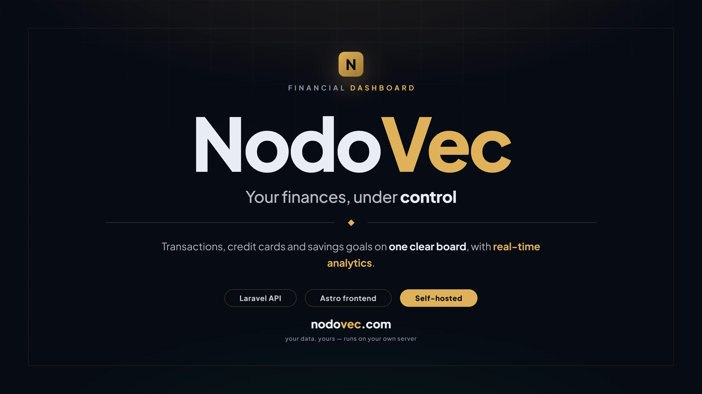

# NodoVec Web



NodoVec es una herramienta web de gestión de finanzas personales. Permite registrar y filtrar transacciones, administrar tarjetas de crédito y sus compras, solicitar financiamientos y seguir metas de ahorro, todo con un dashboard de indicadores y gráficos (vista mensual y anual). Incluye autenticación contra una API backend, modo demo, multi-idioma (español/inglés), selección de moneda y temas personalizables, construido con Astro 5 + React 18.

<video src='docs/assets/nodovec-promo.webm' controls width='800' loop></video>

NodoVec frontend built with Astro 5 + React 18.

## Stack
- **Framework**: Astro 5.16
- **UI Islands**: React 18
- **Styling**: Tailwind CSS v4
- **State**: Custom stores + localStorage
- **Charts**: Recharts, Chart.js, ApexCharts, lightweight-charts
- **Validation**: Zod v4
- **Build**: Vite (via Astro)
- **Runtime and package manager**: Bun 1.2.12

El proyecto usa exclusivamente Bun. No se deben generar ni usar `package-lock.json`, `pnpm-lock.yaml` o `yarn.lock`.

## Setup

```bash
# Install dependencies
bun install --frozen-lockfile

# Environment
cp .env.example .env

# Dev server
bun run dev

# Production build
bun run build
```

## Testing

```bash
# Run Vitest suite
bun run test

# Watch mode
bun run test:watch

# With coverage
bun run test:coverage
```

## Project Structure
```
src/
├── components/
│   ├── chartComponents/      # Recharts wrappers
│   ├── reactComponents/      # Client React components
│   ├── ui/                   # shadcn/ui primitives
│   └── UIComponents/         # Forms, tables, modals
├── pages/                    # Astro file-based routing
├── services/                 # API service layer
├── store/                    # Auth + theme stores
├── lib/                      # Utilities (cn, formatters)
├── i18n/                     # Translations
├── schemas/                  # Zod schemas
└── types/                    # TypeScript interfaces
```

## Key Commands
| Command | Description |
|---------|-------------|
| `bun run dev` | Start dev server |
| `bun run build` | Production build |
| `bun run test` | Run all tests |
| `bun run preview` | Preview production build |

## Environment Variables
| Variable | Description |
|----------|-------------|
| `PUBLIC_API_URL` | Backend API base URL |

## Contributing
See [CONTRIBUTING.md](../docs/CONTRIBUTING.md).
